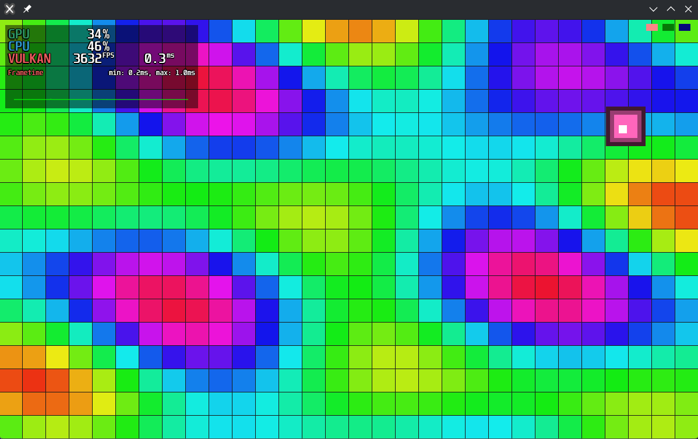
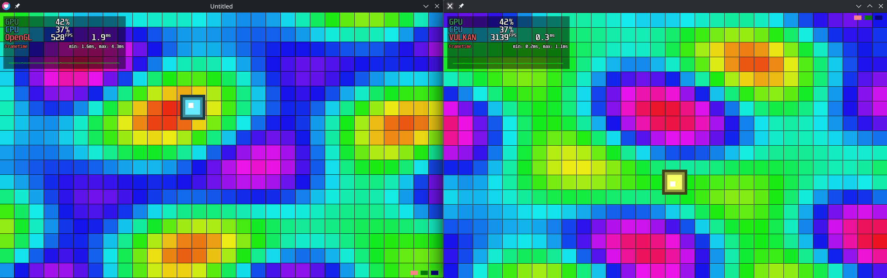

# lupa

An incredibly fast, pure LuaJIT game creation framework.



## How does it compare to Love2D?

This is very experimental, so it's not ready to replace your love2d usage, not yet.



Functionally identical code running on both results in 5x faster speeds on lupa compared to love2d.

## How is it so fast?

Sorted by impact

1. LuaJIT is used throughout the entire process. No Lua C Api overhead.
2. It is written from scratch, so everything can be scrutinized and optimized.
3. Vulkan is used.

## Usage

Set up [lde](https://lde.sh).

```
lde add lupa --git https://github.com/bycruz/lupa
```
